<div align="center">

# SosyaShare

Kotlin ve Jetpack Compose kullanılarak geliştirilmiş modern bir sosyal medya uygulamasıdır.

Kullanıcılar hesap oluşturabilir, gönderi paylaşabilir, diğer kullanıcılarla etkileşim kurabilir ve uygulama üzerinden mesajlaşabilir.

</div>

## Özellikler

* Kullanıcı kaydı ve giriş işlemleri
* Google hesabıyla giriş
* E-posta doğrulama ve şifre sıfırlama
* Fotoğraf ve gönderi paylaşma
* Gönderileri beğenme, yorumlama ve kaydetme
* Kullanıcı ve gönderi arama
* Trend gönderileri görüntüleme
* Profil görüntüleme ve düzenleme
* Kullanıcılar arasında mesajlaşma
* Bildirim sistemi
* Kullanıcı engelleme ve gizlilik ayarları
* Açık ve koyu tema desteği

## Kullanılan Teknolojiler

* Kotlin
* Jetpack Compose
* Material 3
* MVVM
* Clean Architecture
* Firebase Authentication
* Cloud Firestore
* Firebase Storage
* Firebase Cloud Messaging
* Hilt
* Kotlin Coroutines
* Navigation Compose
* Room Database
* Coil

## Proje Yapısı

```text
data/
├── local
├── mapper
├── model
├── remote
└── repository

domain/
├── model
├── repository
└── usecase

presentation/
├── home
├── login
├── profile
├── search
├── share
├── comment
├── message
├── notifications
├── settings
└── trend
```

## Ekran Görüntüleri

<div align="center">
  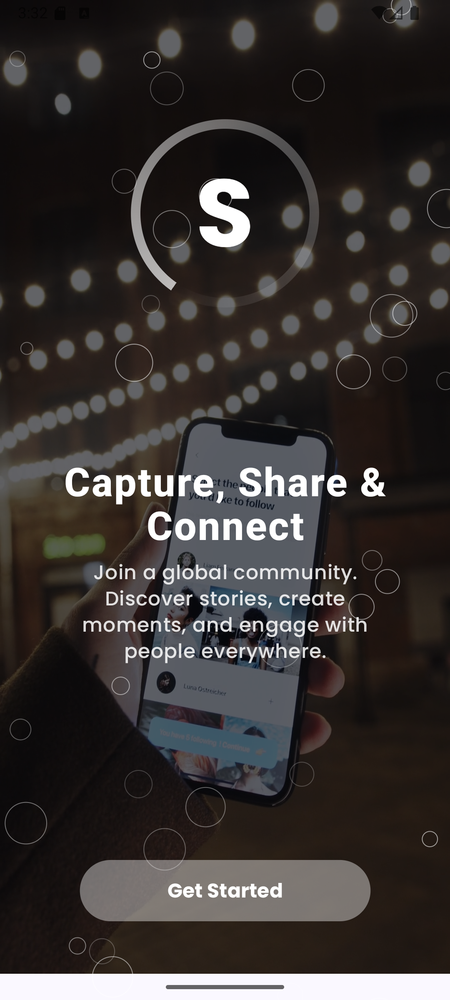
  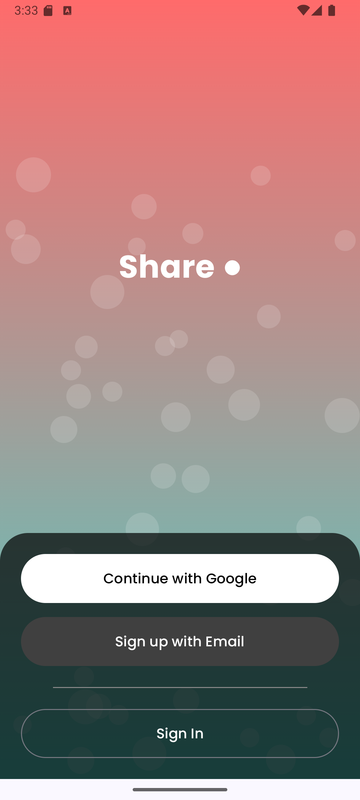
  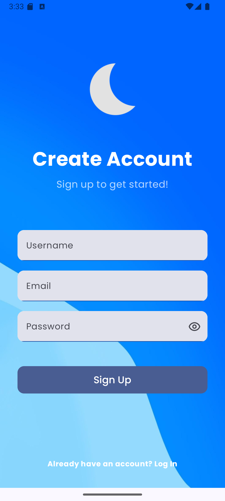
</div>

<br>

<div align="center">
  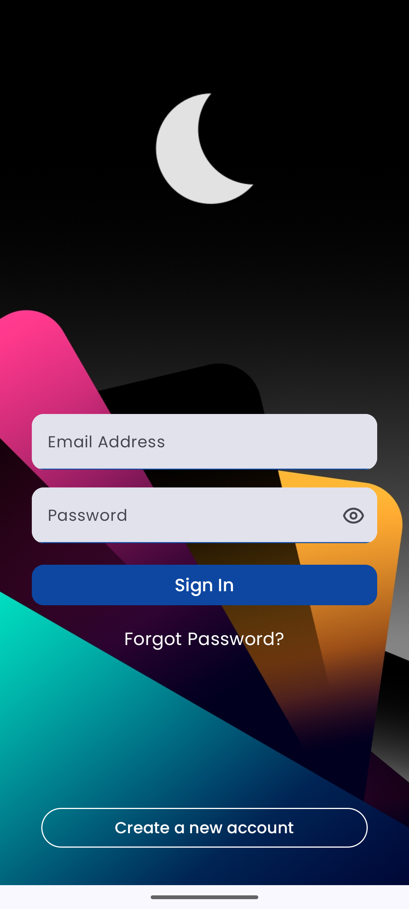
  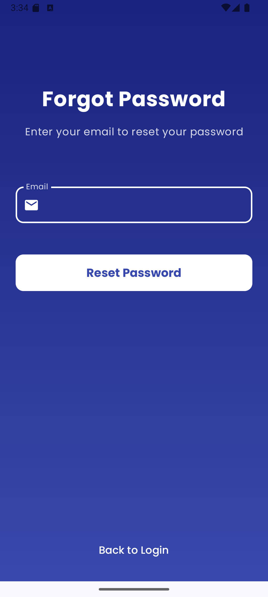
  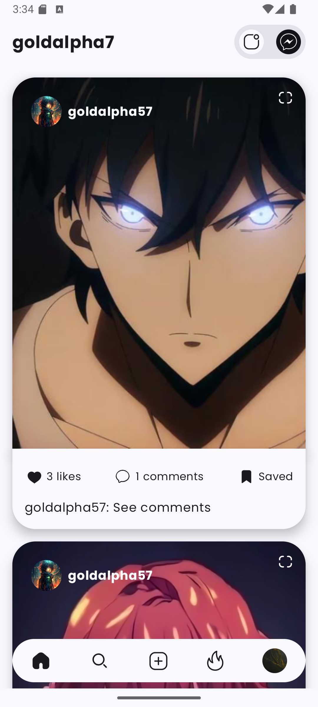
</div>

<br>

<div align="center">
  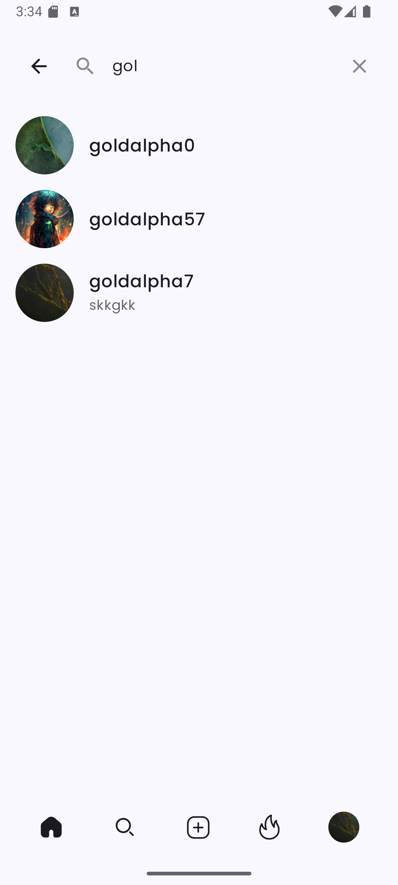
  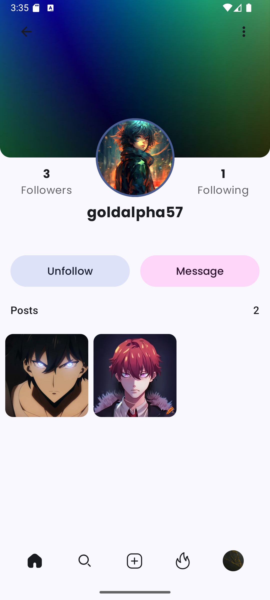
  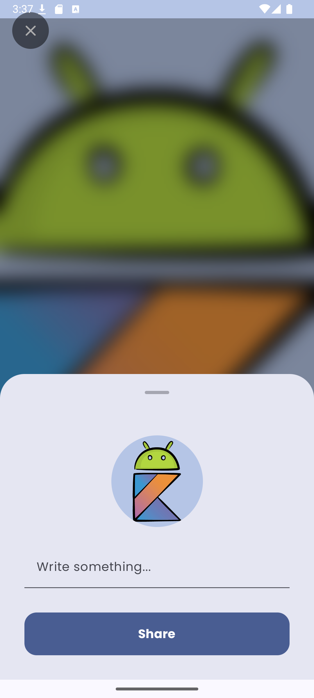
</div>

<br>

<div align="center">
  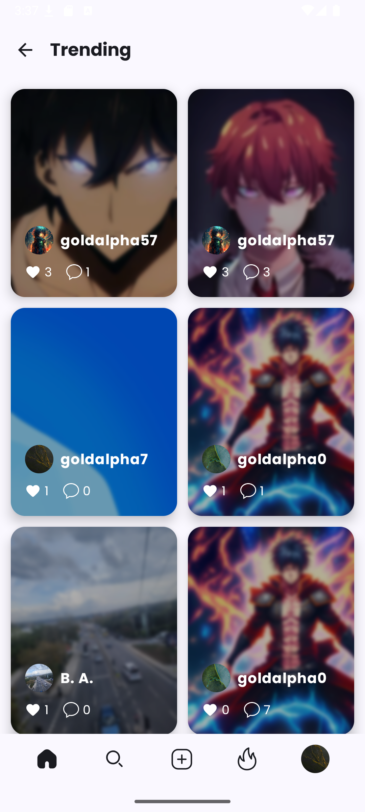
  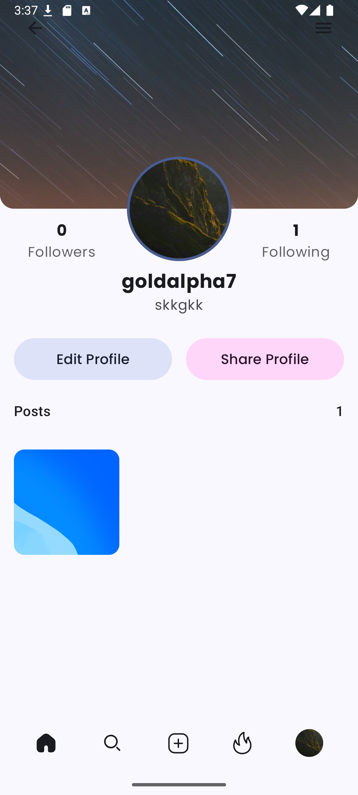
  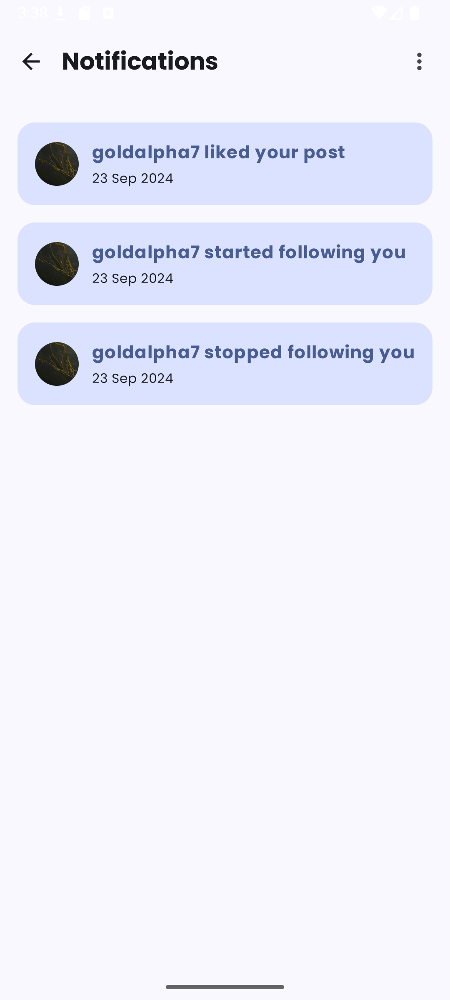
</div>

<br>

<div align="center">
  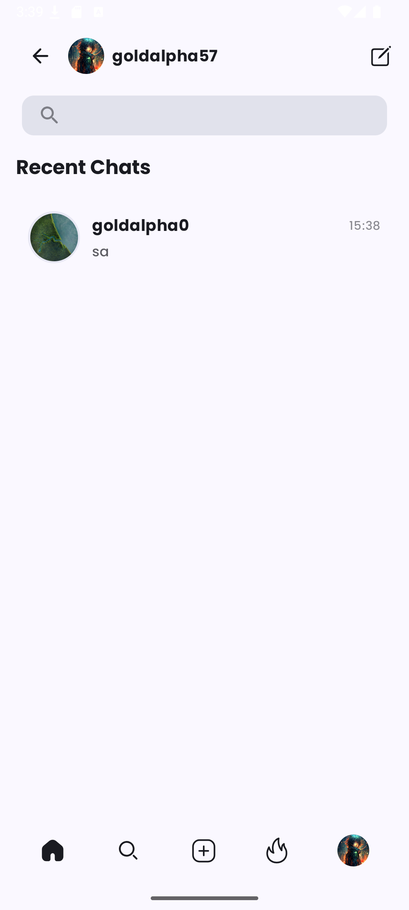
  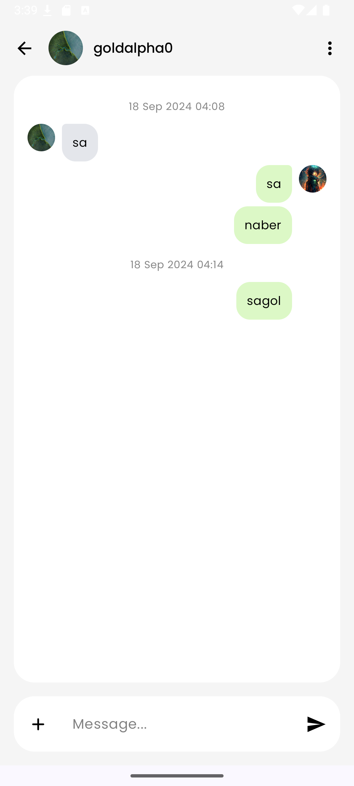
  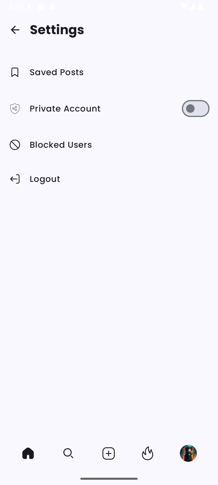
</div>

## Kurulum

Projeyi klonlayın:

```bash
git clone https://github.com/AbdulkadirAkansu/SosyaShare.git
```

Proje klasörüne girin:

```bash
cd SosyaShare
```

Projeyi Android Studio ile açın ve Gradle senkronizasyonunun tamamlanmasını bekleyin.

Uygulamayı çalıştırabilmek için kendi Firebase projenizi oluşturun ve indirdiğiniz `google-services.json` dosyasını `app` klasörüne ekleyin.

```text
SosyaShare/
└── app/
    └── google-services.json
```

## Gereksinimler

* Android Studio
* JDK 17
* Firebase projesi
* Android SDK 34
* Minimum Android sürümü: Android 8.1 / API 27

## Planlanan Geliştirmeler

* Birim ve arayüz testleri
* GitHub Actions entegrasyonu
* Mesajlaşma özelliklerinin geliştirilmesi
* Bildirim sisteminin iyileştirilmesi
* Performans optimizasyonları
* Hata ve yüklenme durumlarının geliştirilmesi
